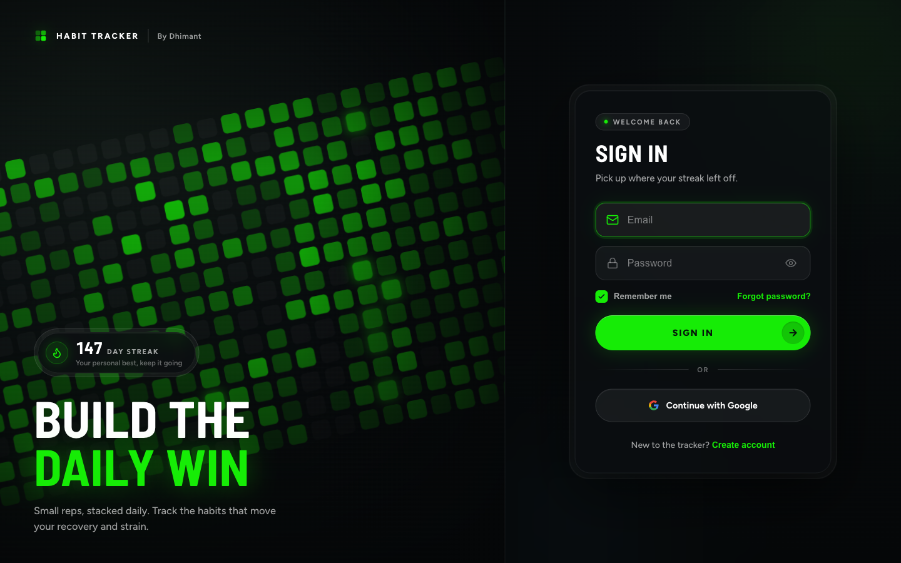
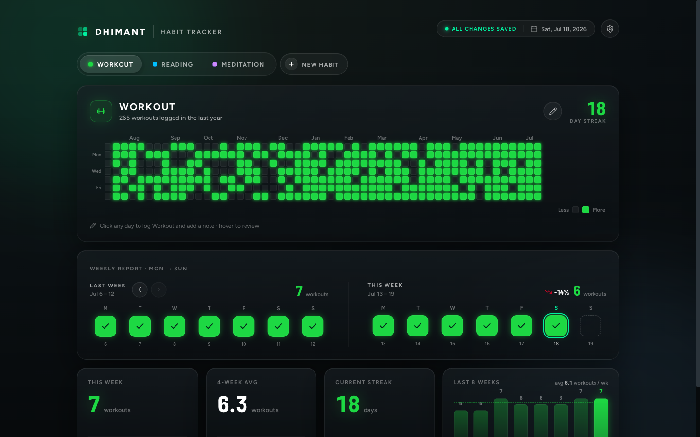
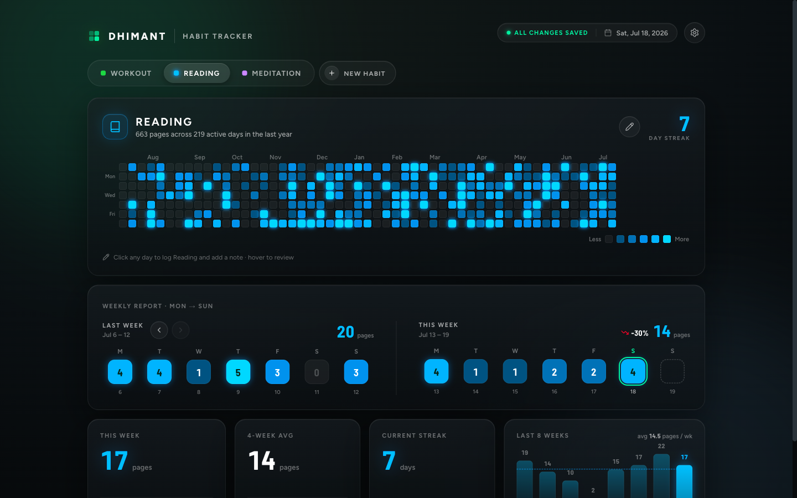
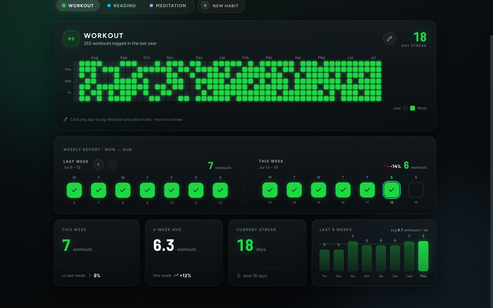
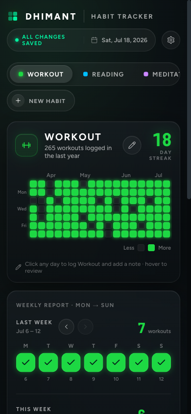

# Habit Tracker

A WHOOP-inspired habit tracker. Create habits, log them on a GitHub-style contribution heatmap, and watch your streaks, weekly trends, and yearly consistency build up — one square at a time.

**Live app → [habit-tracker-sigma-beryl.vercel.app](https://habit-tracker-sigma-beryl.vercel.app)**



## What it does

Every habit gets a year-long heatmap. Click any day to log it (with an optional note), hover to review, and the streaks and stats update in real time — synced to the cloud across all your tabs and devices.



## Features

- **Accounts** — email/password or **Sign in with Google**. Every user's data is private (Postgres row-level security), and password reset works out of the box.
- **Any habit, your way** — yes/no habits (Workout, Meditation) or counted habits (pages read, problems solved) with configurable intensity levels, units, 27 icons, and an 8-color palette.
- **The heatmap** — 53 weeks of history per habit, rendered with a custom oklch color ramp so every habit's palette glows from dark to bright, just like a real contribution graph.
- **Weekly report** — this week vs any past week, day by day. Page back through your history with the ‹ › controls to see how far you've come.
- **Stats that matter** — current streak, personal best, weekly totals, 4-week average, and an 8-week trend chart with your average marked on it.
- **Coding auto-sync** — connect your LeetCode and GeeksforGeeks usernames and a combined "Coding" habit fills itself in every night with the number of unique problems you solved that day. Manual additions are supported and never overwritten by the sync.
- **Realtime everything** — edits appear instantly in every open tab via Postgres change streams.
- **Mobile-ready** — responsive layout, safe-area aware, dark browser chrome on iOS, and a proper home-screen icon.

Per-habit colors run through the whole UI — heatmap, streaks, weekly tiles, and trend bars all take on the habit's own palette:





<p>
  
</p>

## How it's built

The entire app is **one HTML file** — no bundler, no build step, no node_modules.

| Layer | Choice |
|---|---|
| UI | React 18 (ESM via import map) + Framer Motion, compiled in-browser by Babel Standalone |
| Styling | Hand-rolled dark glass design system (CSS variables, oklch color ramps) |
| Backend | [Supabase](https://supabase.com) — Postgres, Auth (email + Google OAuth), row-level security, realtime |
| Coding sync | Supabase Edge Function + `pg_cron` nightly job (LeetCode GraphQL + GeeksforGeeks API) |
| Hosting | Vercel, auto-deploys on every push to `main` |

Notable engineering details:

- **One React instance** shared between the app and Framer Motion via an `esm.sh` import map — the render boots only after the motion runtime is bound.
- **Multi-tenant by default**: every table carries a `user_id` foreign key with `auth.uid() = user_id` RLS policies, so the anon key in the client is safe to ship.
- **Unique problems, not submissions**: the coding sync stores daily cumulative snapshots per platform and derives per-day solved counts from the deltas, with a database trigger materializing the combined habit entries.
- **Performance-minded UI**: the 371-cell heatmap is memoized so hover only re-renders the tooltip, animations stick to compositor-friendly properties, and scroll anchoring quirks are disabled.

## Run it locally

No install needed — it's a static file:

```bash
git clone https://github.com/Dhimant404/habit-tracker.git
cd habit-tracker
python3 -m http.server 8899
# open http://localhost:8899
```

The app talks to its Supabase backend directly from the browser. To point it at your own Supabase project, create the tables and policies described above and swap the `SUPABASE_URL` / `SUPABASE_KEY` constants in `index.html`.

## License

Personal project — feel free to read, learn from, and borrow ideas.
